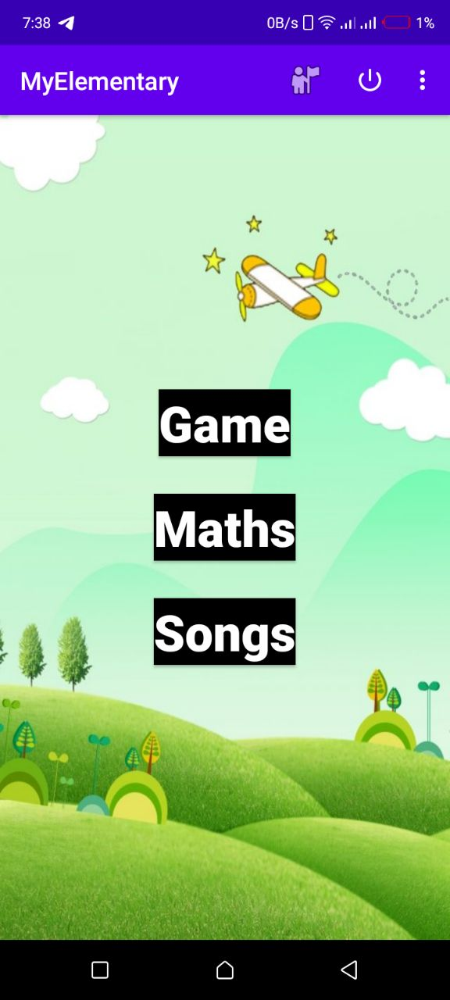

# My Elementary children android application 
Android studio project implemented in native android api and java for educating a children in 
interactive way. 
* you can download the apk file below


[download compiled version here](https://fobybus.github.io/my-elementary/public/download.html)
## structure 
### java source files
java source files are in default package source file in this case 
```
src/main/java
```
- about (activity)
- songs(activity)
- game (activity)
- mainActivity
- maths(activity)
- animal(map game objects to their resource files)
- song(class for song object)
### resources 
- images audio and other raw resource files are in default resource directory

## clone the project 
```
git clone https://github.com/fobybus/my-elementary.git
```
## author 
fobybus(firaol w.)

**please contribute to the project** 🙏
